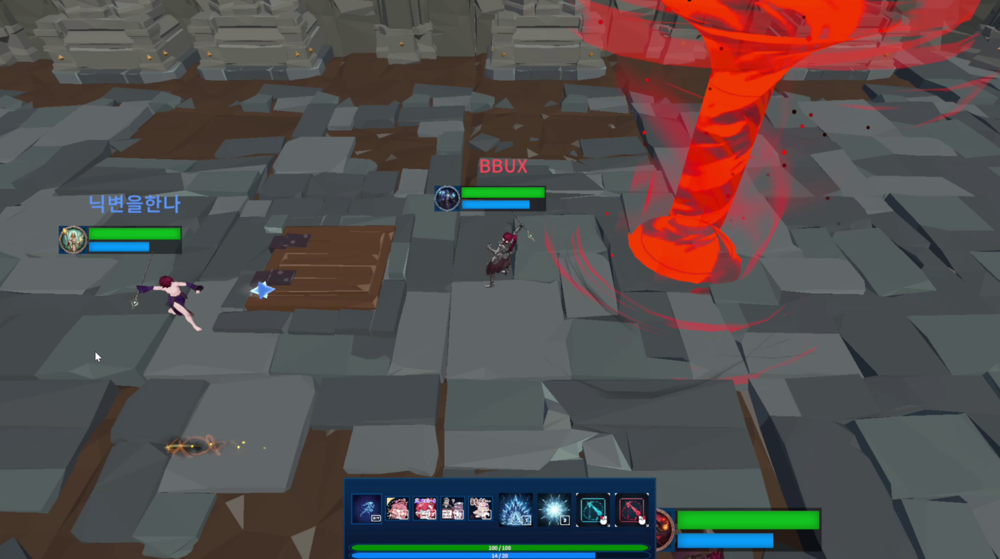
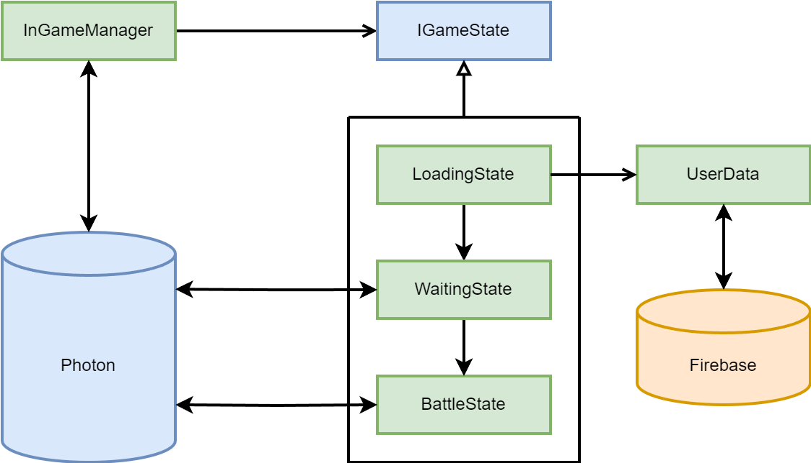

# 팀 프로젝트 - Arena of Colosseum

  
  

---

## 게임 소개

"자신의 실력을 과시하기 위해 싸운다."

상대 팀에게 스킬을 사용해 공격하고, 적 팀을 전멸시키면 승리하는 PvP Only MOBA 장르의 게임입니다.

---

## 🎮 프로젝트 개요

| 항목 | 내용 |
| ------ | ------ |
| **프로젝트명** | Arena of Colosseum |
| **개발 기간** | 2025.09. ~ 2025.10. |
| **개발 인원** | 개발 4인 |
| **개발 엔진** | Unity 2022.3 LTS |
| **개발 언어** | C# |
| **타겟 플랫폼** | Windows |

---

## 주요 기능

### 네트워크 연동
* Photon 및 Firebase와 편한 동기화를 위한 시스템

> #### 관련 스크립트 링크
> * [AuthManager.cs](https://github.com/Sirosi/ArenaOfColosseum/blob/main/Assets/_Project/Scripts/Network/AuthManager.cs)
> * [AuthManager.PunCallbacks.cs](https://github.com/Sirosi/ArenaOfColosseum/blob/main/Assets/_Project/Scripts/Network/AuthManager.PunCallbacks.cs)
> * [UserData.cs](https://github.com/Sirosi/ArenaOfColosseum/blob/main/Assets/_Project/Scripts/Authentication/UserData.cs)

 

### 캐릭터 커스터마이징
* 유저의 캐릭터 커스터마이징을 위한 시스템

> #### 관련 스크립트 링크
> * [CustomCharacter.cs](https://github.com/Sirosi/ArenaOfColosseum/blob/main/Assets/_Project/Scripts/Customizing/CustomCharacter.cs)
> * [CustomHandler.cs](https://github.com/Sirosi/ArenaOfColosseum/blob/main/Assets/_Project/Scripts/Customizing/CustomHandler.cs)
> * [CustomManager.cs](https://github.com/Sirosi/ArenaOfColosseum/blob/main/Assets/_Project/Scripts/Customizing/CustomManager.cs)

 

### 로비 및 대기실 기능
* 다른 유저가 생성한 방의 리스트와 관련된 Photon 기반 시스템
* 다른 유저와 게임을 대기하는 Photon 기반 시스템

> #### 관련 스크립트 링크
> * [LobbyPunManager.cs](https://github.com/Sirosi/ArenaOfColosseum/blob/main/Assets/_Project/Scripts/Network/Lobby/LobbyPunManager.cs)
> * [RoomPunManager.cs](https://github.com/Sirosi/ArenaOfColosseum/blob/main/Assets/_Project/Scripts/Network/Lobby/RoomPunManager.cs)

 

### 인게임 동기화 및 스킬
* 다른 유저와의 인게임 동기화를 위한 Photon 기반 시스템
* 다른 유저와의 PvP를 위해 생성되는 오브젝트

> #### 관련 스크립트 및 폴더 링크
> * [**Network/InGame**](https://github.com/Sirosi/ArenaOfColosseum/tree/main/Assets/_Project/Scripts/Network/InGame)
> * [InGameManager.cs](https://github.com/Sirosi/ArenaOfColosseum/blob/main/Assets/_Project/Scripts/Network/InGame/InGameManager.cs)
> * [InGameManager.Master.cs](https://github.com/Sirosi/ArenaOfColosseum/blob/main/Assets/_Project/Scripts/Network/InGame/InGameManager.Master.cs)
> * [**Skill/Effect**](https://github.com/Sirosi/ArenaOfColosseum/tree/main/Assets/_Project/Scripts/Skill/Effect)
> * [**Skill/Handler**](https://github.com/Sirosi/ArenaOfColosseum/tree/main/Assets/_Project/Scripts/Skill/Handler)
> * [HitObject.cs](https://github.com/Sirosi/ArenaOfColosseum/blob/main/Assets/_Project/Scripts/Skill/HitObject.cs)
> * [**LifeCycle**](https://github.com/Sirosi/ArenaOfColosseum/tree/main/Assets/_Project/Scripts/LifeCycle)

 

### 캐릭터 조작
* 캐릭터의 움직임 및 애니메이션을 동기화하는 Photon 기반 시스템

> #### 관련 스크립트 및 폴더 링크
> * [**Unit**](https://github.com/Sirosi/ArenaOfColosseum/tree/main/Assets/_Project/Scripts/Unit)
> * [Unit.cs](https://github.com/Sirosi/ArenaOfColosseum/blob/main/Assets/_Project/Scripts/Unit/Unit.cs)
> * [PlayerHandler.Move.cs](https://github.com/Sirosi/ArenaOfColosseum/blob/main/Assets/_Project/Scripts/Unit/PlayerHandler.Move.cs)
> * [PlayerHandler.Behaviour.cs](https://github.com/Sirosi/ArenaOfColosseum/blob/main/Assets/_Project/Scripts/Unit/PlayerHandler.Behaviour.cs)

---

 

## Thrid Party Library

  
  

  